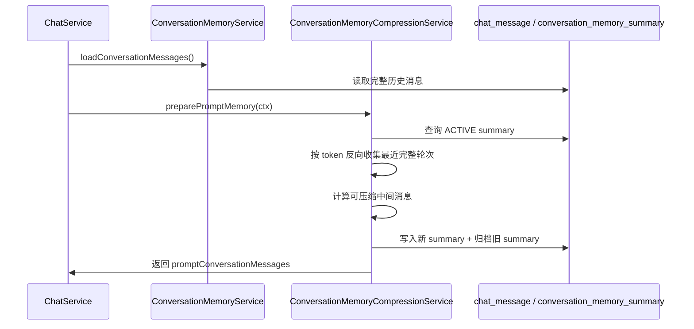

# RAG 会话流水线流程

这份文档统一说明 AI 会话从前端发起到后端生成响应的完整流水线，并把会话记忆压缩流程放在同一条链路里。当前代码已经完成直聊、会话记忆加载、自动 / 手动压缩、空检索兜底和流式输出；查询改写、意图识别、RAG 检索、MCP 工具调用和 grounded prompt 生成仍是后续扩展点。

## 总体链路

```text
ConversationPage
-> Gateway /api/chat 或 /api/chat/stream
-> backend LoginInterceptor
-> ChatController
-> ChatService
-> ConversationFlowExecutor
-> chat/flow 各阶段服务
-> AiInfraClient
-> ai-infra Chat 模型路由
-> 保存 assistant 消息并返回 / SSE done
```

当前 `ConversationFlowExecutor` 是会话流水线编排器，`ChatService` 只负责入口委托和会话管理，不承载具体阶段逻辑。

## 主流程阶段

| 顺序 | 阶段 | 当前实现 | 主要类 |
| ---: | --- | --- | --- |
| 1 | 准备会话 | 解析模型、取最后一条 user 消息、创建或恢复会话 | `ConversationLifecycleService` |
| 2 | 压缩状态检查 | 如果当前会话正在手动压缩，拒绝继续发送 | `ConversationMemoryCompressionService` |
| 3 | 加载完整历史 | 从 Redis 缓存读取，缓存缺失回源 `chat_message` | `ConversationMemoryService`、`ChatMessageCacheService` |
| 4 | 保存本轮 user 消息 | 当前问题先落库，再加入上下文消息列表 | `ChatMessagePersistenceService` |
| 5 | 准备 Prompt 记忆 | 判断是否自动压缩，生成 `promptConversationMessages` | `ConversationMemoryCompressionService` |
| 6 | 查询改写 | 当前占位，默认使用原始问题 | `QueryRewriteService` |
| 7 | 意图识别 | 当前占位，默认 `DIRECT_CHAT` | `IntentResolutionService` |
| 8 | 歧义引导 | 如果需要澄清，短路返回引导语 | `ClarificationService` |
| 9 | 直聊短路 | `DIRECT_CHAT` 不进入 RAG，直接调用 LLM | `DirectChatService` |
| 10 | 多通道检索 | 当前返回空结果占位，后续接知识库和 MCP 工具 | `RetrievalExecuteService` |
| 11 | 空检索兜底 | 检索为空时返回“未检索到与问题相关的文档。” | `RetrievalExecuteService` |
| 12 | Prompt 组装 | 直聊已实现；grounded prompt 当前仍复用直聊请求 | `PromptAssemblyService` |
| 13 | 生成响应 | 直聊已实现；RAG 响应当前返回占位提示 | `DirectChatService`、`ConversationFlowExecutor` |
| 14 | assistant 落库 | 保存回答、更新会话时间、刷新 Redis 消息缓存 | `ChatMessagePersistenceService` |
| 15 | 流式写出 | SSE `start` / `delta` / `done` / `error` | `ChatStreamResponseWriter` |

同步接口和流式接口共用同一套阶段。差异是流式接口会先创建 `SseEmitter`，在线程池里执行 `doExecuteStream(...)`，并用 `ConversationStreamRegistry` 标记当前会话正在输出，避免手动压缩和流式输出并发写摘要。

## 当前执行路径

### 直聊路径

```text
prepareRequest(ctx)
-> rewrite(ctx)
-> resolve(ctx)
-> guidanceMessage(ctx) == null
-> isDirectChat(ctx) == true
-> DirectChatService.generate/stream(ctx)
-> completeAssistantMessage(ctx)
-> 返回 ChatResponse 或 SSE done
```

### RAG / 工具路径

```text
prepareRequest(ctx)
-> rewrite(ctx)
-> resolve(ctx)
-> guidanceMessage(ctx) == null
-> isDirectChat(ctx) == false
-> retrieve(ctx)
-> emptyRetrievalMessage(retrievalCtx)
   -> 有兜底消息：短路返回
   -> 有检索结果：进入 grounded response
-> buildGroundedRequest(ctx, retrievalCtx)
-> 调用 LLM
-> 保存 assistant 消息
```

当前 `RetrievalExecuteService.retrieve(...)` 仍返回 `RetrievalContext.empty()`，所以非直聊意图会走空检索兜底；`streamGroundedResponse(...)` 和 `generateGroundedResponse(...)` 也还是占位。

## RAG 后续接入点

后续实现 RAG 时，不要把逻辑堆回 `ChatService`，优先扩展 `chat/flow` 子包。

推荐拆分：

| 子阶段 | 职责 | 建议落点 |
| --- | --- | --- |
| 查询改写 | 根据历史上下文改写用户问题，拆分子问题 | `QueryRewriteService` |
| 意图识别 | 判断 `DIRECT_CHAT`、`KNOWLEDGE_RAG`、`TOOL_CALL`、`RAG_AND_TOOL`、`CLARIFICATION` | `IntentResolutionService` |
| 歧义引导 | 知识库范围、时间、对象不明确时短路让用户澄清 | `ClarificationService` |
| 知识库检索 | query embedding、pgvector 召回、metadata 过滤 | `RetrievalExecuteService` 或拆 `KnowledgeRetrievalService` |
| Rerank | 对召回片段重排并过滤低分片段 | `RetrievalExecuteService` 或拆 `RerankService` |
| MCP 工具 | 并行调用可用工具，收集结构化结果 | `RetrievalExecuteService` 或拆 `ToolRetrievalService` |
| 结果融合 | 合并知识库片段和工具结果，控制 token 预算 | `RetrievalContext` |
| Prompt 组装 | 注入引用片段、工具结果、回答约束 | `PromptAssemblyService.buildGroundedRequest(...)` |
| 有据回答 | LLM 根据检索上下文回答，并保存引用信息 | `ConversationFlowExecutor.generateGroundedResponse(...)` |

`RetrievalContext` 当前只有：

```text
knowledgeSnippets
toolResults
```

后续可以扩展为包含 `documentId`、`chunkId`、`score`、`sourceTitle`、`toolName`、`metadata` 等结构化字段。

## 会话记忆压缩

会话记忆压缩发生在 RAG / 直聊共同的 `prepareRequest(ctx)` 阶段，位置在“加载完整历史”和“查询改写”之间。

```text
prepare conversation
-> load full messages
-> persist current user message
-> prepare prompt memory
   -> 查询 ACTIVE summary
   -> 估算 Prompt 记忆 token
   -> 达到阈值则自动压缩
   -> 生成 promptConversationMessages
-> rewrite query
-> resolve intents
-> direct chat / RAG / tools
```

### 数据原则

- `chat_message` 永远保存完整原始消息，不删除、不覆盖。
- `conversation_memory_summary` 只保存压缩摘要和已覆盖消息范围。
- Prompt 看到的是压缩后的轻量上下文，详情页看到的仍然是完整原始消息。
- 摘要水位线使用消息雪花 ID，只比较大小，不计算差值。

`conversation_memory_summary` 核心字段：

| 字段 | 说明 |
| --- | --- |
| `conversation_id` | 所属会话主键 |
| `user_id` | 所属用户 |
| `summary_content` | 压缩后的会话摘要 |
| `covered_start_message_id` | 摘要覆盖的第一条消息 ID |
| `covered_end_message_id` | 摘要覆盖的最后一条消息 ID |
| `source_message_count` | 当前摘要累计覆盖的原始消息数 |
| `summary_tokens` | 摘要 token 粗略估算 |
| `compression_model_id` | 执行压缩的模型 |
| `compression_version` | 压缩提示词版本 |
| `trigger_type` | `AUTO` 或 `MANUAL` |
| `status` | `ACTIVE` 或 `ARCHIVED` |

正确水位线判断：

```sql
id > covered_end_message_id
```

不要使用：

```sql
id - covered_end_message_id
```

因为雪花 ID 递增但不连续。

### 自动压缩触发

触发阈值不是直接使用模型最大上下文，而是先扣掉输出、RAG、工具和安全余量：

```text
memoryBudget =
  contextMaxTokens
  - outputReserveTokens
  - ragReserveTokens
  - toolReserveTokens
  - safetyMarginTokens

memoryTokens >= memoryBudget * autoCompressThresholdRatio
```

当前默认：

| 配置 | 默认值 |
| --- | ---: |
| `CHAT_MEMORY_CONTEXT_MAX_TOKENS` | `100000` |
| `CHAT_MEMORY_OUTPUT_RESERVE_TOKENS` | `8000` |
| `CHAT_MEMORY_RAG_RESERVE_TOKENS` | `12000` |
| `CHAT_MEMORY_TOOL_RESERVE_TOKENS` | `4000` |
| `CHAT_MEMORY_SAFETY_MARGIN_TOKENS` | `4000` |
| `CHAT_MEMORY_AUTO_COMPRESS_THRESHOLD_RATIO` | `0.9` |

默认记忆预算是 `72000`，硬触发点是 `64800`。

### 压缩范围

第一次压缩：

```text
全量消息
-> 保留头部 N 条原文
-> 压缩中间消息
-> 保留最近窗口消息
```

再次压缩：

```text
旧 summary
+ id > coveredEndMessageId
+ 不属于最近窗口的 message
=> 新 summary
=> coveredEndMessageId 往后推进
```

当前默认：

| 配置 | 默认值 | 说明 |
| --- | ---: | --- |
| `CHAT_MEMORY_HEAD_MESSAGE_COUNT` | `4` | 首轮对话锚点，保留原文 |
| `CHAT_MEMORY_RECENT_WINDOW_TOKENS` | `20000` | 最近窗口 token 预算，保留原文 |
| `CHAT_MEMORY_MIN_COMPRESS_MESSAGE_COUNT` | `8` | 少于这个数量不压缩 |
| `CHAT_MEMORY_COMPRESSION_WINDOW_TOKENS` | `24000` | 单次压缩窗口预算 |
| `CHAT_MEMORY_MAX_SUMMARY_TOKENS` | `4000` | 期望摘要上限 |

### 实现思路

这套压缩不是按消息条数切窗口，而是按 token 做尾部窗口控制，同时保持消息轮次完整。

1. 先拿到 `conversation_memory_summary` 里的 `coveredEndMessageId`，只处理它之后的新消息。
2. 把新消息按完整轮次分组，默认按 `user + assistant` 配对；如果尾部只剩一条 `user`，也把它当成一个完整轮次。
3. 从最新轮次开始向前累计 token，直到再加一轮会超过 `CHAT_MEMORY_RECENT_WINDOW_TOKENS` 为止。
4. 窗口边界不能切半条消息，也不能切半轮次；如果单轮本身就超过预算，也整轮保留。
5. 头部锚点消息永远保留原文，中间区域进入压缩，尾部窗口保持原文。
6. 压缩完成后写入新的 `conversation_memory_summary`，旧 summary 归档，`chat_message` 永远不删。



### Prompt 记忆视图

没有活跃摘要：

```text
system prompt
+ 全量 chat_message
+ current user message
```

有活跃摘要：

```text
system prompt
+ id < coveredStartMessageId 的头部原文消息
+ system message: 历史会话摘要
+ 分割线: ----- 上下文已压缩，以下为最近未压缩对话 -----
+ id > coveredEndMessageId 的原文消息
+ current user message
```

`PromptAssemblyService.buildDirectRequest(...)` 使用 `ctx.promptConversationMessages()`，因此直聊和后续 RAG grounded prompt 都应该基于压缩后的 Prompt 记忆视图继续组装。

### 手动压缩

接口：

```text
POST /api/conversations/{conversationId}/memory/compress
```

流程：

```text
校验登录态
-> 校验会话属于当前用户
-> 如果当前 service 实例正在流式输出该会话，返回 409
-> 如果当前 service 实例正在压缩该会话，返回 409
-> 读取完整 chat_message
-> 查询 ACTIVE summary
-> 计算可压缩范围
-> 调用 LLM 生成新 summary
-> 插入新的 ACTIVE summary
-> 归档旧 summary
-> 返回 coveredEndMessageId 等信息
```

前端会在输入框左侧提供“压缩”按钮；压缩中禁止继续发送，消息列表显示“正在压缩上下文”，成功后插入“上下文已压缩”分割线。SSE `start` 事件和会话详情会返回当前 ACTIVE summary，前端只按服务端真实水位线恢复 token 圆环和分割线。

## 异常和短路点

| 短路点 | 条件 | 返回 |
| --- | --- | --- |
| 会话压缩中 | 当前会话正在手动压缩 | 业务错误 `409` / SSE error |
| 歧义引导 | `ClarificationService` 返回引导语 | assistant 静态消息 |
| 直聊意图 | `IntentResolutionService.isDirectChat(ctx)` 为 true | 直接 LLM |
| 空检索 | `RetrievalContext.isEmpty()` 为 true | `未检索到与问题相关的文档。` |
| 客户端断开 | SSE 写出抛 `ClientDisconnectedException` | 安静完成，不再写 JSON 错误体 |

## 当前边界

- RAG 检索、Rerank、MCP 工具调用和 grounded prompt 还没有真正实现。
- 自动压缩是硬阈值同步压缩，暂未做响应结束后的软阈值异步压缩。
- 流式输出状态登记器和压缩会话级锁是当前 service 实例内存状态；多实例部署时需要换成 Redis 锁或数据库锁。
- token 计算是粗略估算，后续可以接模型 tokenizer 或 ai-infra token 计数接口。
- 压缩模型复用当前会话模型，后续可以单独配置低成本压缩模型。

## 关键文件

| 文件 | 职责 |
| --- | --- |
| `chat/flow/ConversationFlowExecutor.java` | 编排会话主流程和短路点 |
| `chat/flow/context/ChatExecutionContext.java` | 跨阶段传递用户、会话、模型、记忆、意图、SSE |
| `chat/flow/lifecycle/ConversationLifecycleService.java` | 创建 / 恢复会话，解析模型和最新用户消息 |
| `chat/flow/memory/ConversationMemoryService.java` | 加载完整历史消息 |
| `chat/flow/memory/ConversationMemoryCompressionService.java` | 自动 / 手动压缩，构建 Prompt 记忆视图 |
| `chat/flow/query/QueryRewriteService.java` | 查询改写和子问题拆分占位 |
| `chat/flow/intent/IntentResolutionService.java` | 意图识别占位 |
| `chat/flow/clarification/ClarificationService.java` | 歧义引导占位 |
| `chat/flow/retrieval/RetrievalExecuteService.java` | 多通道检索占位 |
| `chat/flow/retrieval/RetrievalContext.java` | 检索结果上下文 |
| `chat/flow/prompt/PromptAssemblyService.java` | 构造直聊 / grounded LLM 请求 |
| `chat/flow/llm/DirectChatService.java` | 普通直聊模型调用 |
| `chat/flow/message/ChatMessagePersistenceService.java` | user / assistant 消息落库和缓存刷新 |
| `chat/flow/response/ChatStreamResponseWriter.java` | SSE 事件写出 |
