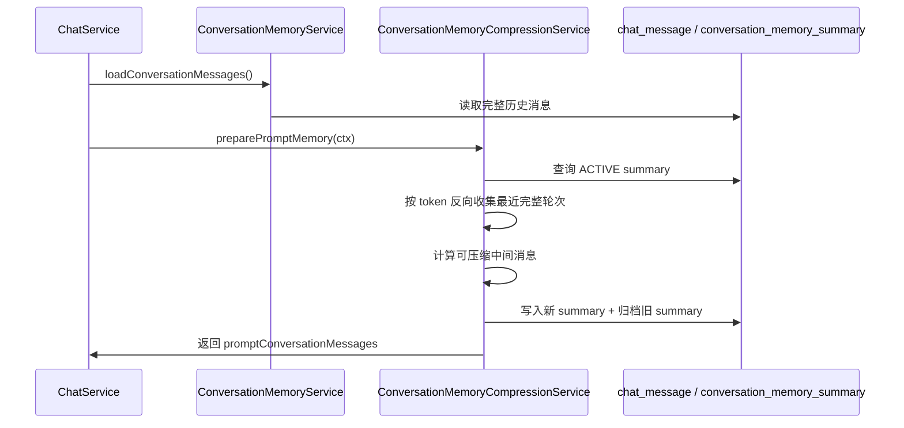

# RAG 会话流水线流程

这份文档统一说明 AI 会话从前端发起到后端生成响应的完整流水线，并把会话记忆压缩流程放在同一条链路里。当前代码已经完成直聊、会话记忆加载、自动 / 手动压缩、查询改写、意图识别树、歧义引导、空检索兜底和流式输出；RAG 检索、MCP 工具调用和 grounded prompt 生成仍是后续扩展点。

## 总体链路

```text
ConversationPage
-> Gateway /api/chat 或 /api/chat/stream
-> backend LoginInterceptor
-> ChatController
-> ChatService
-> ConversationFlowExecutor
-> chat/flow 各阶段服务
-> AiInfraClient
-> ai-infra Chat 模型路由
-> 保存 assistant 消息并返回 / SSE done
```

当前 `ConversationFlowExecutor` 是会话流水线编排器，`ChatService` 只负责入口委托和会话管理，不承载具体阶段逻辑。

## 主流程阶段

| 顺序 | 阶段 | 当前实现 | 主要类 |
| ---: | --- | --- | --- |
| 1 | 准备会话 | 解析模型、取最后一条 user 消息、创建或恢复会话 | `ConversationLifecycleService` |
| 2 | 压缩状态检查 | 如果当前会话正在手动压缩，拒绝继续发送 | `ConversationMemoryCompressionService` |
| 3 | 加载完整历史 | 从 Redis 缓存读取，缓存缺失回源 `chat_message` | `ConversationMemoryService`、`ChatMessageCacheService` |
| 4 | 保存本轮 user 消息 | 当前问题先落库，再加入上下文消息列表 | `ChatMessagePersistenceService` |
| 5 | 准备 Prompt 记忆 | 判断是否自动压缩，生成 `promptConversationMessages` | `ConversationMemoryCompressionService` |
| 6 | 查询改写 | 术语统一、LLM 语义改写、问题拆分、容错解析、降级和记录 | `QueryRewriteService`、`TerminologyNormalizationService`、`QueryRewriteResultParser` |
| 7 | 意图识别 | 规则优先命中叶子节点；弱规则缩小候选；LLM 对候选叶子打分；总量封顶并检测歧义 | `IntentResolutionService`、`RuleIntentRouter`、`IntentClassifier` |
| 8 | 歧义引导 | 如果需要澄清，短路返回引导语 | `ClarificationService` |
| 9 | 直聊短路 | `DIRECT_CHAT` 不进入 RAG，直接调用 LLM | `DirectChatService` |
| 10 | 多通道检索 | 当前返回空结果占位，后续接知识库和 MCP 工具 | `RetrievalExecuteService` |
| 11 | 空检索兜底 | 检索为空时返回“未检索到与问题相关的文档。” | `RetrievalExecuteService` |
| 12 | Prompt 组装 | 直聊已实现；grounded prompt 当前仍复用直聊请求 | `PromptAssemblyService` |
| 13 | 生成响应 | 直聊已实现；RAG 响应当前返回占位提示 | `DirectChatService`、`ConversationFlowExecutor` |
| 14 | assistant 落库 | 保存回答、更新会话时间、刷新 Redis 消息缓存 | `ChatMessagePersistenceService` |
| 15 | 流式写出 | SSE `start` / `delta` / `done` / `error` | `ChatStreamResponseWriter` |

同步接口和流式接口共用同一套阶段。差异是流式接口会先创建 `SseEmitter`，在线程池里执行 `doExecuteStream(...)`，并用 `ConversationStreamRegistry` 标记当前会话正在输出，避免手动压缩和流式输出并发写摘要。

## 流水线 Trace 和耗时阶段

assistant 调试 Trace 会随 assistant 消息保存到 `chat_message.assistant_trace_json`，并在普通响应、SSE `done` 事件和会话历史详情中返回给前端。Trace 顶层必须带 `traceVersion`，当前版本为 `1`；前端按版本做兼容，不靠猜字段存在与否判断结构。`chat_message.response_duration_ms` 表示本轮端到端总耗时，不再表示最后一次 LLM 调用耗时。

耗时拆分统一使用 `durationStages` 数组，不再继续为每个新增阶段往 Trace 顶层追加 `xxxDurationMs` 字段。结构如下：

```json
{
  "traceVersion": 1,
  "durationStages": [
    {
      "code": "query_rewrite",
      "label": "查询改写",
      "durationMs": 1234
    }
  ]
}
```

当前标准阶段：

| code | label | 来源 |
| --- | --- | --- |
| `query_rewrite` | 查询改写 | `QueryRewriteService.finishRewrite(...)` / `ctx.setQueryRewriteDurationMs(...)` |
| `intent_resolve` | 意图识别 | `IntentResolutionService.finishResolve(...)` / `ctx.setIntentResolveDurationMs(...)` |
| `rag` | RAG | `ConversationFlowExecutor.retrieveWithTrace(...)` / `ctx.setRagTrace(...)`，仅进入 RAG 时记录 |
| `llm` | LLM | `ChatMessagePersistenceService.buildDurationStages(...)` 从 `AssistantResponseResult.responseDurationMs` 添加；`STATIC` 响应不记录 |
| `other` | 其他 | `total - 已知 stages - llm`，用于承接准备会话、保存消息、封装上下文等暂未细分的耗时 |

后续新增向量化、向量检索、上下文封装等子阶段时，优先在对应阶段服务里记录：

```java
ctx.recordDurationStage("embedding", "向量化", durationMs);
ctx.recordDurationStage("vector_search", "向量检索", durationMs);
ctx.recordDurationStage("prompt_assembly", "上下文封装", durationMs);
```

前端 `utils/assistantTrace.js` 负责归一化 Trace，`components/AssistantTracePanel.vue` 负责渲染 `assistantTrace.durationStages` 作为“耗时拆分”，`ConversationPage.vue` 只保留 Trace 开关和消息挂载。旧的 `llmDurationMs` / `otherDurationMs` 只保留历史兼容，不作为新增开发入口。

## 当前执行路径

### 直聊路径

```text
prepareRequest(ctx)
-> rewrite(ctx)
-> resolve(ctx)
-> guidanceMessage(ctx) == null
-> isDirectChat(ctx) == true
-> DirectChatService.generate/stream(ctx)
-> completeAssistantMessage(ctx)
-> 返回 ChatResponse 或 SSE done
```

### RAG / 工具路径

```text
prepareRequest(ctx)
-> rewrite(ctx)
-> resolve(ctx)
-> guidanceMessage(ctx) == null
-> isDirectChat(ctx) == false
-> retrieve(ctx)
-> emptyRetrievalMessage(retrievalCtx)
   -> 有兜底消息：短路返回
   -> 有检索结果：进入 grounded response
-> buildGroundedRequest(ctx, retrievalCtx)
-> 调用 LLM
-> 保存 assistant 消息
```

当前 `RetrievalExecuteService.retrieve(...)` 仍返回 `RetrievalContext.empty()`，所以 KB / MCP / RAG_AND_TOOL 意图会走空检索兜底；`streamGroundedResponse(...)` 和 `generateGroundedResponse(...)` 也还是占位。

## RAG 后续接入点

后续实现 RAG 时，不要把逻辑堆回 `ChatService`，优先扩展 `chat/flow` 子包。

推荐拆分：

| 子阶段 | 职责 | 建议落点 |
| --- | --- | --- |
| 查询改写 | 根据历史上下文改写用户问题，拆分子问题 | `QueryRewriteService` |
| 意图识别 | 判断 `DIRECT_CHAT`、`KNOWLEDGE_RAG`、`TOOL_CALL`、`RAG_AND_TOOL`、`CLARIFICATION` | `IntentResolutionService` |
| 歧义引导 | 知识库范围、时间、对象不明确时短路让用户澄清 | `ClarificationService` |
| 知识库检索 | query embedding、pgvector 召回、metadata 过滤 | `RetrievalExecuteService` 或拆 `KnowledgeRetrievalService` |
| Rerank | 对召回片段重排并过滤低分片段 | `RetrievalExecuteService` 或拆 `RerankService` |
| MCP 工具 | 并行调用可用工具，收集结构化结果 | `RetrievalExecuteService` 或拆 `ToolRetrievalService` |
| 结果融合 | 合并知识库片段和工具结果，控制 token 预算 | `RetrievalContext` |
| Prompt 组装 | 注入引用片段、工具结果、回答约束 | `PromptAssemblyService.buildGroundedRequest(...)` |
| 有据回答 | LLM 根据检索上下文回答，并保存引用信息 | `ConversationFlowExecutor.generateGroundedResponse(...)` |

`RetrievalContext` 当前只有：

```text
knowledgeSnippets
toolResults
```

后续可以扩展为包含 `documentId`、`chunkId`、`score`、`sourceTitle`、`toolName`、`metadata` 等结构化字段。

## 查询改写和问题拆分

查询改写发生在会话记忆压缩之后、意图识别之前。它不是回答用户问题，而是把本轮问题转换成后续意图识别和 RAG 检索更稳定的结构化查询。

```text
originalQuery
-> 术语统一 normalizeTerms
-> LLM 语义改写 + 问题拆分
-> 容错解析 JSON
-> 降级为 normalizedQuery
-> 写入 ctx.rewriteResult
-> 写入 chat_query_rewrite_record
-> resolve intents
```

### 术语统一

术语统一使用两张表维护：

| 表 | 说明 |
| --- | --- |
| `chat_terminology_term` | 标准术语，例如 `Gateway`、`RAG`、`ConversationMemory` |
| `chat_terminology_alias` | 用户说法和别名，例如 `网关`、`gateway`、`知识库`、`kb` |

读取时使用 Redis 旁路缓存：

```text
查询 Redis String: yinbo:agent:chat:terminology:enabled:v1
-> 命中：反序列化启用术语快照
-> 未命中：查 PostgreSQL term + alias
-> 组装整份启用术语 JSON 快照
-> 写回 Redis
```

写入时先更新数据库，事务提交后删除缓存。下次读取会重建术语快照。匹配时先把所有 alias 拉平成候选列表，按别名长度、标准词优先级、别名优先级排序，再在 JVM 内存中扫描本轮问题；英文别名会检查单词边界，中文别名直接按片段匹配，重叠命中保留最长优先。

术语统一只改写当前查询内部使用的 `normalizedQuery`，不会覆盖用户原始输入。

### 语义改写和问题拆分

语义改写和问题拆分通过一次 LLM 调用完成。输入包含：

```text
当前改写任务 system prompt
+ 当前会话 active summary，如果存在
+ 最近 N 轮 user/assistant 对话，默认 3 轮
+ 本轮 normalizedQuery
```

历史 `system` 消息不会进入改写上下文，避免挤占 token 或影响改写任务。当前改写调用会使用自己的 system prompt，并要求模型严格返回：

```json
{
  "rewrite": "改写后的查询",
  "should_split": false,
  "sub_questions": ["改写后的查询"]
}
```

解析器会依次处理普通 JSON、Markdown 代码块 JSON、前后带额外文本的 JSON；字段缺失或结构异常时进入降级。

### 降级策略

Pipeline 配置来自 `chat_pipeline_config`，后台可以通过 `/admin/pipeline` 修改。关键字段：

| 字段 | 说明 |
| --- | --- |
| `terminology_enabled` | 是否启用术语统一，默认开启 |
| `llm_rewrite_enabled` | 是否调用 LLM 做语义改写和拆分 |
| `rule_split_enabled` | 是否允许规则拆分兜底 |
| `fallback_policy` | `TERM_ONLY`、`RULE_SPLIT` 或 `BYPASS` |
| `rewrite_timeout_ms` | 改写调用超时时间 |
| `rewrite_context_turns` | 改写上下文最近轮数 |

LLM 关闭、调用超时、模型异常或 JSON 解析失败时，不中断会话主流程。默认降级为：

```json
{
  "rewrite": "术语统一后的问题",
  "should_split": false,
  "sub_questions": ["术语统一后的问题"]
}
```

最终结果写入 `ctx.rewriteResult`，供后续意图识别、检索和工具路由使用。中间产物会写入 `chat_query_rewrite_record`，用于后续 RAG 命中率评估、Prompt 调优和问题回放；它不会写入 `chat_message`，不会污染真实会话历史。

## 意图识别树

意图识别发生在查询改写之后、歧义引导之前。它不是简单的四分类，而是把用户问题路由到可执行的叶子节点：KB 知识库、MCP 工具或 SYSTEM 系统交互。

```text
ctx.rewriteResult.subQuestions
-> RuleIntentRouter
   -> 强规则命中叶子：直接返回 NodeScore，不调用 LLM
   -> 弱规则命中领域：缩小候选叶子范围
   -> 未命中规则：使用全部启用叶子
-> IntentClassifier
   -> LLM 给候选叶子节点打分
   -> IntentClassificationParser 容错解析 JSON
-> 分数过滤 + 单问题数量限制
-> capTotalIntents 总量封顶
-> detectAmbiguity 歧义检测
-> 写入 ctx.intentResult / ctx.intents / ctx.ambiguous
-> 写入 chat_intent_resolve_record
-> 打印 event=intent_resolved 结构化日志
```

多个子问题会提交到 `intentClassifyExecutor` 专用线程池并行识别，`classify-timeout-ms` 是本轮意图分类等待上限。超时或异常的子问题会降级为空意图，不会阻塞其他子问题；LLM 分类器本身不再使用 Java common pool，避免慢模型调用影响其他异步任务。

每轮识别都会打印结构化日志，方便本地直接看是否命中成功：

```text
event=intent_resolved conversationId=... userMessageId=... outcome=SUCCESS fallbackReason=- intents=[TOOL_CALL] ambiguous=false selectedNodeCount=1 topNode=logistics-tracking:MCP:0.95:RULE selectedNodes=[logistics-tracking:MCP:0.95:RULE] subQuestionCount=1 durationMs=12
event=intent_resolved conversationId=... userMessageId=... outcome=FALLBACK fallbackReason=INTENT_CLASSIFY_TIMEOUT intents=[DIRECT_CHAT] ambiguous=false selectedNodeCount=0 topNode=- selectedNodes=[] subQuestionCount=1 durationMs=3003
```

同一份结果会写入 `chat_intent_resolve_record`，用于后续 bad case 回放和命中率评估。核心字段包括原始问题、归一化问题、改写问题、子问题 JSON、最终 `ChatIntentType`、命中节点 JSON、子问题意图 JSON、歧义状态、引导问题、`outcome`、`fallback_reason`、模型和耗时。记录失败只写 warn 日志，不影响主会话流程。

强规则来自 `chat_intent_rule`，用于高确定性表达，例如：

| 用户问题 | 结果 |
| --- | --- |
| `我的快递到哪了？` | 直接命中 `物流与配送 > 物流轨迹查询`，类型 `MCP` |
| `你好` | 直接命中 `系统交互 > 欢迎与问候`，类型 `SYSTEM` |
| `你是谁？` | 直接命中 `系统交互 > 关于助手`，类型 `SYSTEM` |

弱规则只缩小范围，不直接决定最终叶子。例如 `运费怎么算` 会缩到物流相关叶子，再由 LLM 判断是国内运费规则还是跨境运费计算；如果两个高分候选分数接近，会设置 `ctx.ambiguous = true`，由 `ClarificationService` 短路返回引导问题。

规则内容不写死在 Java 代码里。`RuleIntentRouter` 只负责通用匹配引擎，规则由数据库和后台维护：

| 字段 | 说明 |
| --- | --- |
| `target_node_code` | 命中后指向的意图节点，强规则应指向叶子节点，弱规则可以指向 DOMAIN / CATEGORY |
| `rule_type` | `STRONG` 直接返回 `NodeScore`；`WEAK` 只展开候选叶子 |
| `include_keywords_json` | 包含词组，支持 `ANY` / `ALL` |
| `require_keywords_json` | 必要词组，支持 `ANY` / `ALL` |
| `exclude_keywords_json` | 排除词组，任一命中则规则失效 |
| `score` | 强规则命中后的分数 |

默认物流轨迹和订单查询强规则已经加入解释类排除词，例如 `什么意思`、`是什么意思`、`含义`、`概念`、`定义`、`解释一下`、`这句话`。这样 `我的快递到哪了` 会命中物流 MCP，但 `你知道快递到哪是什么意思吗` 不会被误拦截。

规则读取也使用 Redis 旁路缓存：

```text
Redis key: yinbo:agent:chat:intent-rules:v1
-> 命中：反序列化启用规则快照
-> 未命中：查询 chat_intent_rule enabled=true
-> 写回 Redis
```

后台新增、修改、启停、删除规则后，会在事务提交后清理规则缓存。

意图树使用 `chat_intent_node` 表持久化。数据库存扁平行，运行时通过 `parent_code` 组装树，Redis 缓存启用状态的整棵树：

```text
Redis key: yinbo:agent:chat:intent-tree:v1
-> 命中：反序列化 IntentNode roots
-> 未命中：查询 chat_intent_node enabled=true
-> 组装 roots / allNodes / leafNodes / nodeById
-> 写回 Redis
```

后台意图节点新增、修改、启停、删除后会在事务提交后清理缓存。禁用父节点时会递归禁用子节点，避免出现“父节点停用但叶子节点仍参与匹配”的不一致。

如果节点已经被 `chat_intent_rule.target_node_code` 引用，后台会拒绝修改该节点的 `node_code`，也会拒绝删除该节点。这样可以避免规则仍命中旧编码、但运行时找不到目标节点的静默路由失败。

关键配置位于 `app.chat.intent`：

| 配置 | 默认值 | 说明 |
| --- | --- | --- |
| `enabled` | `true` | 是否启用意图识别 |
| `llm-enabled` | `true` | 是否允许 LLM 对叶子节点打分 |
| `min-score` | `0.35` | 代码侧最低保留分数 |
| `ambiguity-min-score` | `0.55` | 歧义候选最低分 |
| `ambiguity-score-gap` | `0.08` | 两个高分候选最大分差 |
| `max-intents` | `3` | 下游最多保留的意图总数 |
| `classify-timeout-ms` | `3000` | 意图分类 LLM 超时 |
| `cache-ttl` | `60m` | 意图树 Redis 快照 TTL |

LLM 分类失败不会触发歧义引导。异常属于系统问题，会降级为空意图或规则强命中结果；歧义引导只用于用户表达本身不明确的情况。

规则层回归测试集位于 `backend/src/test/resources/intent-rule-bad-cases.csv`，当前包含 50 条样例，覆盖物流轨迹、订单查询、系统问候、助手介绍，以及解释类、规则类、运费清关类误伤场景。`RuleIntentRouterBadCaseTest` 会逐条验证强规则命中结果，避免后续改规则时把 `快递到哪是什么意思` 这类问题重新误判成 MCP。

## 会话记忆压缩

会话记忆压缩发生在 RAG / 直聊共同的 `prepareRequest(ctx)` 阶段，位置在“加载完整历史”和“查询改写”之间。

```text
prepare conversation
-> load full messages
-> persist current user message
-> prepare prompt memory
   -> 查询 ACTIVE summary
   -> 估算 Prompt 记忆 token
   -> 达到阈值则自动压缩
   -> 生成 promptConversationMessages
-> rewrite query
-> resolve intents
-> direct chat / RAG / tools
```

### 数据原则

- `chat_message` 永远保存完整原始消息，不删除、不覆盖。
- `conversation_memory_summary` 只保存压缩摘要和已覆盖消息范围。
- Prompt 看到的是压缩后的轻量上下文，详情页看到的仍然是完整原始消息。
- 摘要水位线使用消息雪花 ID，只比较大小，不计算差值。

`conversation_memory_summary` 核心字段：

| 字段 | 说明 |
| --- | --- |
| `conversation_id` | 所属会话主键 |
| `user_id` | 所属用户 |
| `summary_content` | 压缩后的会话摘要 |
| `covered_start_message_id` | 摘要覆盖的第一条消息 ID |
| `covered_end_message_id` | 摘要覆盖的最后一条消息 ID |
| `source_message_count` | 当前摘要累计覆盖的原始消息数 |
| `summary_tokens` | 摘要 token 粗略估算 |
| `compression_model_id` | 执行压缩的模型 |
| `compression_version` | 压缩提示词版本 |
| `trigger_type` | `AUTO` 或 `MANUAL` |
| `status` | `ACTIVE` 或 `ARCHIVED` |

正确水位线判断：

```sql
id > covered_end_message_id
```

不要使用：

```sql
id - covered_end_message_id
```

因为雪花 ID 递增但不连续。

### 自动压缩触发

触发阈值不是直接使用模型最大上下文，而是先扣掉输出、RAG、工具和安全余量：

```text
memoryBudget =
  contextMaxTokens
  - outputReserveTokens
  - ragReserveTokens
  - toolReserveTokens
  - safetyMarginTokens

memoryTokens >= memoryBudget * autoCompressThresholdRatio
```

当前默认：

| 配置 | 默认值 |
| --- | ---: |
| `CHAT_MEMORY_CONTEXT_MAX_TOKENS` | `100000` |
| `CHAT_MEMORY_OUTPUT_RESERVE_TOKENS` | `8000` |
| `CHAT_MEMORY_RAG_RESERVE_TOKENS` | `12000` |
| `CHAT_MEMORY_TOOL_RESERVE_TOKENS` | `4000` |
| `CHAT_MEMORY_SAFETY_MARGIN_TOKENS` | `4000` |
| `CHAT_MEMORY_AUTO_COMPRESS_THRESHOLD_RATIO` | `0.9` |

默认记忆预算是 `72000`，硬触发点是 `64800`。

### 压缩范围

第一次压缩：

```text
全量消息
-> 保留头部 N 条原文
-> 压缩中间消息
-> 保留最近窗口消息
```

再次压缩：

```text
旧 summary
+ id > coveredEndMessageId
+ 不属于最近窗口的 message
=> 新 summary
=> coveredEndMessageId 往后推进
```

当前默认：

| 配置 | 默认值 | 说明 |
| --- | ---: | --- |
| `CHAT_MEMORY_HEAD_MESSAGE_COUNT` | `4` | 首轮对话锚点，保留原文 |
| `CHAT_MEMORY_RECENT_WINDOW_TOKENS` | `20000` | 最近窗口 token 预算，保留原文 |
| `CHAT_MEMORY_MIN_COMPRESS_MESSAGE_COUNT` | `8` | 少于这个数量不压缩 |
| `CHAT_MEMORY_COMPRESSION_WINDOW_TOKENS` | `24000` | 单次压缩窗口预算 |
| `CHAT_MEMORY_MAX_SUMMARY_TOKENS` | `4000` | 期望摘要上限 |

### 实现思路

这套压缩不是按消息条数切窗口，而是按 token 做尾部窗口控制，同时保持消息轮次完整。

1. 先拿到 `conversation_memory_summary` 里的 `coveredEndMessageId`，只处理它之后的新消息。
2. 把新消息按完整轮次分组，默认按 `user + assistant` 配对；如果尾部只剩一条 `user`，也把它当成一个完整轮次。
3. 从最新轮次开始向前累计 token，直到再加一轮会超过 `CHAT_MEMORY_RECENT_WINDOW_TOKENS` 为止。
4. 窗口边界不能切半条消息，也不能切半轮次；如果单轮本身就超过预算，也整轮保留。
5. 头部锚点消息永远保留原文，中间区域进入压缩，尾部窗口保持原文。
6. 压缩完成后写入新的 `conversation_memory_summary`，旧 summary 归档，`chat_message` 永远不删。



### Prompt 记忆视图

没有活跃摘要：

```text
system prompt
+ 全量 chat_message
+ current user message
```

有活跃摘要：

```text
system prompt
+ id < coveredStartMessageId 的头部原文消息
+ system message: 历史会话摘要
+ 分割线: ----- 上下文已压缩，以下为最近未压缩对话 -----
+ id > coveredEndMessageId 的原文消息
+ current user message
```

`PromptAssemblyService.buildDirectRequest(...)` 使用 `ctx.promptConversationMessages()`，因此直聊和后续 RAG grounded prompt 都应该基于压缩后的 Prompt 记忆视图继续组装。

### 手动压缩

接口：

```text
POST /api/conversations/{conversationId}/memory/compress
```

流程：

```text
校验登录态
-> 校验会话属于当前用户
-> 如果当前 service 实例正在流式输出该会话，返回 409
-> 如果当前 service 实例正在压缩该会话，返回 409
-> 读取完整 chat_message
-> 查询 ACTIVE summary
-> 计算可压缩范围
-> 调用 LLM 生成新 summary
-> 插入新的 ACTIVE summary
-> 归档旧 summary
-> 返回 coveredEndMessageId 等信息
```

前端会在输入框左侧提供“压缩”按钮；压缩中禁止继续发送，消息列表显示“正在压缩上下文”，成功后插入“上下文已压缩”分割线。SSE `start` 事件和会话详情会返回当前 ACTIVE summary，前端只按服务端真实水位线恢复 token 圆环和分割线。

## 异常和短路点

| 短路点 | 条件 | 返回 |
| --- | --- | --- |
| 会话压缩中 | 当前会话正在手动压缩 | 业务错误 `409` / SSE error |
| 歧义引导 | `ClarificationService` 返回引导语 | assistant 静态消息 |
| 直聊意图 | `IntentResolutionService.isDirectChat(ctx)` 为 true | 直接 LLM |
| 空检索 | `RetrievalContext.isEmpty()` 为 true | `未检索到与问题相关的文档。` |
| 客户端断开 | SSE 写出抛 `ClientDisconnectedException` | 安静完成，不再写 JSON 错误体 |

## 当前边界

- RAG 检索、Rerank、MCP 工具调用和 grounded prompt 还没有真正实现。
- 自动压缩是硬阈值同步压缩，暂未做响应结束后的软阈值异步压缩。
- 流式输出状态登记器和压缩会话级锁是当前 service 实例内存状态；多实例部署时需要换成 Redis 锁或数据库锁。
- token 计算是粗略估算，后续可以接模型 tokenizer 或 ai-infra token 计数接口。
- 压缩模型复用当前会话模型，后续可以单独配置低成本压缩模型。

## 关键文件

| 文件 | 职责 |
| --- | --- |
| `chat/flow/ConversationFlowExecutor.java` | 编排会话主流程和短路点 |
| `chat/flow/context/ChatExecutionContext.java` | 跨阶段传递用户、会话、模型、记忆、意图、SSE，并通过 `recordDurationStage(...)` 统一记录耗时阶段 |
| `chat/flow/lifecycle/ConversationLifecycleService.java` | 创建 / 恢复会话，解析模型和最新用户消息 |
| `chat/flow/memory/ConversationMemoryService.java` | 加载完整历史消息 |
| `chat/flow/memory/ConversationMemoryCompressionService.java` | 自动 / 手动压缩，构建 Prompt 记忆视图 |
| `chat/flow/query/QueryRewriteService.java` | 查询改写和子问题拆分占位 |
| `chat/flow/intent/IntentResolutionService.java` | 意图识别编排 |
| `chat/flow/clarification/ClarificationService.java` | 歧义引导占位 |
| `chat/flow/retrieval/RetrievalExecuteService.java` | 多通道检索占位 |
| `chat/flow/retrieval/RetrievalContext.java` | 检索结果上下文 |
| `chat/flow/prompt/PromptAssemblyService.java` | 构造直聊 / grounded LLM 请求 |
| `chat/flow/llm/DirectChatService.java` | 普通直聊模型调用 |
| `chat/flow/message/ChatMessagePersistenceService.java` | user / assistant 消息落库、Trace JSON 构建、总耗时和 `durationStages` 持久化、缓存刷新 |
| `chat/flow/response/ChatStreamResponseWriter.java` | SSE 事件写出 |
